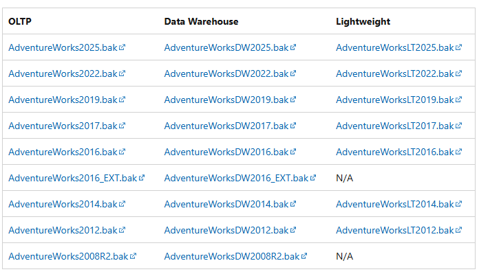
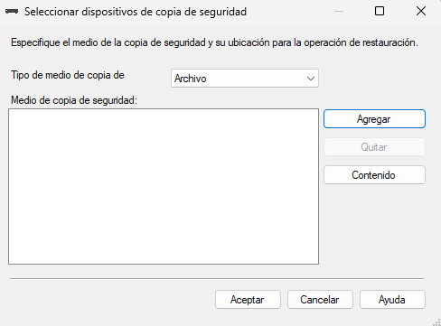

# DP-800 Laboratorio 03 - Write advanced T-SQL queries

**Enlace teoría:** https://learn.microsoft.com/en-us/training/modules/write-advanced-sql-code/
**Enlace ejercicio:** https://microsoftlearning.github.io/mslearn-sql-developer/Instructions/Labs/03-write-advanced-tsql-code.html

**Autor:** Christian Salguero Varas
**Fecha:** 21/09/2026

---

## 1. Restauración de la base de datos

Accedemos a esta página web https://learn.microsoft.com/en-us/sql/samples/adventureworks-install-configure?view=sql-server-ver17&tabs=ssms .

Bajando un poco veremos una tabla con ficheros con nombre AdventureWorks2025.bak.



Nos descargamos el primero fichero de la columna Lightweight.

Para restaurarla abrimos nuestro SSMS, hacemos click derecho en ‘Bases de datos’ o ‘Databases’ y pulsamos en ‘Restaurar base de datos’.


Se abrirá una ventana en la que debemos marcas ‘Dispositivo’ y pulsar los tres puntitos.


Se abrirá otra ventana en la que debemos pulsas ‘Agregar’ y seleccionar el fichero que acabamos de descargar.



Pulsamos en ‘Aceptar’ y se nos completarán todos los campos automáticamente por lo que solo queda pulsar de nuevo en ‘Aceptar’.

---

## 2. Conectarse a AdventureWorksLT

```sql
 -- Verify key tables in AdventureWorksLT
 SELECT TOP (5) ProductID, Name, ListPrice 
 FROM SalesLT.Product;
    
 SELECT TOP (5) ProductCategoryID, Name 
 FROM SalesLT.ProductCategory;
```

---

## 3. Construir una salida JSON a partir de datos de productos

### Create a JSON object for each product

```sql
 SELECT 
     ProductID,
     Name,
     Color,
     ListPrice
 FROM SalesLT.Product
 WHERE Color IS NOT NULL
 ORDER BY ListPrice DESC
 FOR JSON PATH;
```

### Create nested JSON with product categories

```sql
 SELECT 
     p.ProductID,
     p.Name AS ProductName,
     p.ListPrice,
     JSON_OBJECT(
         'CategoryID': pc.ProductCategoryID,
         'CategoryName': pc.Name
     ) AS Category
 FROM SalesLT.Product AS p
 INNER JOIN SalesLT.ProductCategory AS pc
     ON p.ProductCategoryID = pc.ProductCategoryID
 ORDER BY p.ListPrice DESC
 FOR JSON PATH;
```

---

## 4. Combinar JSON con una CTE y una función de ventana

### Write a CTE with window function ranking

```sql
 WITH RankedProducts AS (
     SELECT 
         p.ProductID,
         p.Name AS ProductName,
         pc.Name AS CategoryName,
         p.ListPrice,
         ROW_NUMBER() OVER (
             PARTITION BY pc.ProductCategoryID 
             ORDER BY p.ListPrice DESC
         ) AS PriceRank
     FROM SalesLT.Product AS p
     INNER JOIN SalesLT.ProductCategory AS pc
         ON p.ProductCategoryID = pc.ProductCategoryID
     WHERE p.ListPrice > 0
 )
 SELECT 
     ProductID,
     ProductName,
     CategoryName,
     ListPrice,
     PriceRank
 FROM RankedProducts
 WHERE PriceRank <= 3
 ORDER BY CategoryName, PriceRank;
```

### Output the ranked products as JSON

```sql
 WITH RankedProducts AS (
     SELECT 
         p.ProductID,
         p.Name AS ProductName,
         pc.Name AS CategoryName,
         p.ListPrice,
         ROW_NUMBER() OVER (
             PARTITION BY pc.ProductCategoryID 
             ORDER BY p.ListPrice DESC
         ) AS PriceRank
     FROM SalesLT.Product AS p
     INNER JOIN SalesLT.ProductCategory AS pc
         ON p.ProductCategoryID = pc.ProductCategoryID
     WHERE p.ListPrice > 0
 )
 SELECT 
     ProductID,
     ProductName,
     CategoryName,
     ListPrice,
     PriceRank
 FROM RankedProducts
 WHERE PriceRank <= 3
 ORDER BY CategoryName, PriceRank
 FOR JSON PATH, ROOT('TopProducts');
```

---

## 5. Parsear datos JSON con OPENJSON

### Parse a JSON array into rows

```sql
 DECLARE @ProductUpdates NVARCHAR(MAX) = N'[
     {"ProductID": 680, "NewPrice": 1250.00},
     {"ProductID": 706, "NewPrice": 1450.00},
     {"ProductID": 707, "NewPrice": 38.99}
 ]';

 SELECT 
     ProductID,
     NewPrice
 FROM OPENJSON(@ProductUpdates)
 WITH (
     ProductID INT '$.ProductID',
     NewPrice DECIMAL(10,2) '$.NewPrice'
 );
```

### Join parsed JSON with existing data

```sql
 DECLARE @ProductUpdates NVARCHAR(MAX) = N'[
     {"ProductID": 680, "NewPrice": 1250.00},
     {"ProductID": 706, "NewPrice": 1450.00},
     {"ProductID": 707, "NewPrice": 38.99}
 ]';

 SELECT 
     p.ProductID,
     p.Name,
     p.ListPrice AS CurrentPrice,
     updates.NewPrice,
     updates.NewPrice - p.ListPrice AS PriceDifference
 FROM SalesLT.Product AS p
 INNER JOIN OPENJSON(@ProductUpdates)
 WITH (
     ProductID INT '$.ProductID',
     NewPrice DECIMAL(10,2) '$.NewPrice'
 ) AS updates
     ON p.ProductID = updates.ProductID;
```